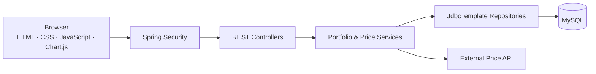

# Portfolio Manager

Portfolio Manager is an investment portfolio management system built with Spring Boot, Spring Security, and Spring JDBC. It provides login authentication, portfolio holding management, portfolio summary statistics, real-time price snapshot features, and ready-to-use static frontend pages.

## Team Work Division

| Member | Git Username        | Responsible Module                                       |
| ------ | ------------------- | -------------------------------------------------------- |
| Yang   | QY                  | Project Architecture & Security Authentication & Testing |
| Viggo  | Middle-Earth-source | Portfolio Core Business Logic & Testing                  |
| Grace  | wangdi-666          | Price Snapshot Module & Testing                          |
| Susan  | scyyw8-sw           | Frontend UI & Testing & Documentation                    |

## Feature Overview

- Account login and session protection with form login and HTTP Basic
- Portfolio holding management: create, query, update, and delete holdings
- Portfolio summary statistics: total cost, total market value, total profit/loss, and allocation by ticker
- Real-time price snapshots: fetch external market data, persist snapshots, and query the latest snapshot
- Visual frontend dashboard: holdings table, return trend, allocation chart, and market price snapshot chart

## Project Architecture



The front end is served directly from `src/main/resources/static`. It uses the same Spring Boot deployment and communicates with `/api/**` endpoints.

## Tech Stack

| Area                | Technology                                                   |
| ------------------- | ------------------------------------------------------------ |
| Main Language       | Java 17                                                      |
| Application         | Spring Boot 3.3                                              |
| Security            | Spring Security                                              |
| Validation          | Spring Validation                                            |
| Data access         | Spring JDBC                                                  |
| Production database | MySQL 8                                                      |
| Front end           | HTML, CSS, Vanilla JavaScript, Chart.js                      |
| Tests               | JUnit 5, Spring Boot Test, Spring Security Test, H2 test database, JaCoCo |
| Delivery            | GitHub Actions and Docker                                    |

## How to Run locally

### 1. Create the database

created `portfolioDb` with `users` and `portfolio_items` and `price_snapshots` tables.

### 2. Configure the connection

The default connection is defined in `src/main/resources/application.properties`. Override sensitive values through environment variables instead of committing real credentials:

```bash
export SPRING_DATASOURCE_URL="jdbc:mysql://localhost:3306/portfolioDb"
export SPRING_DATASOURCE_USERNAME="root"
export SPRING_DATASOURCE_PASSWORD="your-password"
```

### 3. Start the application

macOS/Linux:

```bash
sh mvnw spring-boot:run
```

Windows:

```powershell
.\mvnw.cmd spring-boot:run
```

Open [http://localhost:6300](http://localhost:6300).

Demo credentials:

- Username: `admin`
- Password: `admin123`

## Test and coverage

The project includes tests for Controller, Service, Repository, Security, Exception handling, and related modules.

Run tests with PowerShell:

```powershell
Set-Location "xxx\xian-nova-portfoliomanager"
.\mvnw.cmd test
```

The current test suite has passed locally, with no failed cases in the Surefire reports.

## Main API

| Method   | Endpoint                             | Purpose                                 |
| -------- | ------------------------------------ | --------------------------------------- |
| `GET`    | `/api/auth/me`                       | Return the authenticated user           |
| `GET`    | `/api/portfolio/items`               | List the current user’s positions       |
| `POST`   | `/api/portfolio/items`               | Add a position                          |
| `PUT`    | `/api/portfolio/items/{id}`          | Update an owned position                |
| `DELETE` | `/api/portfolio/items/{id}`          | Remove an owned position                |
| `GET`    | `/api/portfolio/summary`             | Return value, cost, P/L, and allocation |
| `POST`   | `/api/price-snapshots/{ticker}/sync` | Fetch and store a market snapshot       |
| `GET`    | `/api/price-snapshots/{ticker}`      | Return the latest stored snapshot       |
| `GET`    | `/api/price-snapshots/{ticker}/live` | Fetch and return a live snapshot        |

## Repository structure

```text
src/
  main/
    java/org/xian/protfoliomanage/
      config/            # Security configuration
      Controller/        # Business and authentication APIs
      Service/           # Business logic and external market data calls
      Repository/        # JDBC data access
      Model/             # Entities and enums
      Dto/               # Request/response DTOs
      exception/         # Global exception handling
    resources/
      application.properties
      schema.sql
      static/            # Frontend pages and assets
  test/
    java/...             # Controller/Service/Repository/Config/Exception tests
    resources/
      application.properties
```

## Project documentation

- [Project timeline](docs/ProjectTimeline.md)
- [Trello board](docs/TRELLO_BOARD.md)
- [Team presentation slides](docs/presentation/Portfolio-Manager-Team-Presentation.pptx)

