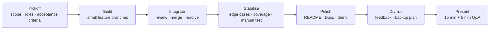

# Project Timeline

## Recommended sequence

| Phase | Focus | Exit evidence |
|---|---|---|
| Kickoff | Clarify scope, define architecture, create Trello cards, assign owners | Agreed acceptance criteria and board |
| Build | Deliver vertical features in small branches | Working feature PRs with tests |
| Integrate | Merge through PR resolve conflicts, review across the team | Stable integrated application |
| Stabilise | Add edge cases, enforce coverage, execute manual acceptance tests | Passing `verify` and defect log |
| Polish | Improve UI, README, demo data | Manager-ready repository |
| Dry run | Rehearse slides and live demo; collect direct feedback | Revised deck and backup recording/screenshots |
| Present | Demonstrate the product | Team participation and prepared Q&A |

## Actual project record

Replace the brackets with dates and evidence from Trello and Git:

| Date | Milestone | Decision or issue | Evidence |
|---|---|---|---|
| `[2026-07-24]` | Kickoff | `[scope decision]` | `[Trello/meeting link]` |
| `[2026-07-27]` | First vertical feature | `[technical decision]` | `[PR/commit]` |
| `[2026-07-28]` | Integration | `[conflict or dependency]` | `[PR/Trello card]` |
| `[20206-07-29]` | Stabilisation | `[defect found and fixed]` | `[test/report]` |
| `[2026-07-30]` | Dry run | `[feedback received]` | `[deck version/recording]` |
| `[2026-07-31]` | Final presentation | `[final outcome]` | `[release/tag]` |
